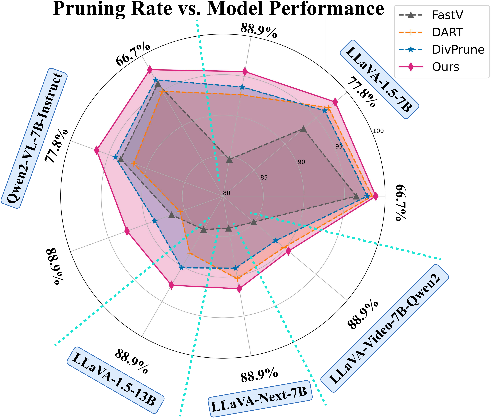
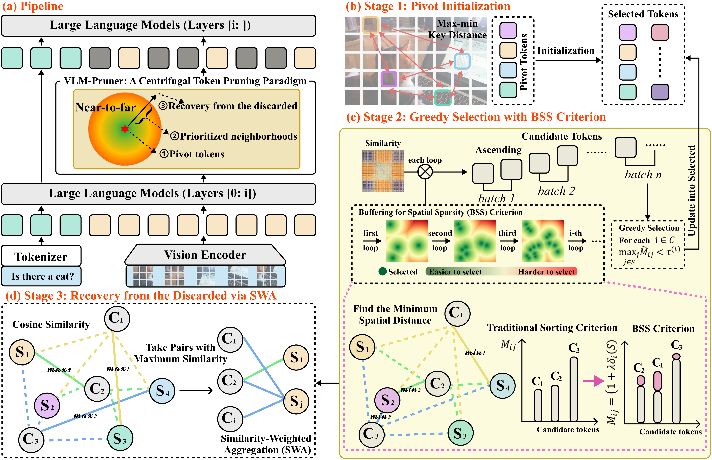

# VLM-Pruner: Buffering for Spatial Sparsity in an Efficient VLM Centrifugal Token Pruning Paradigm

## Note
The usage is coming soon in December 2025!

## 🔥 News
- `2025/12/15`: The official implementation of VLM-Pruner is available!
- `2025/12/02`: VLM-Pruner has been submitted to Arxiv, see [here](https://arxiv.org/abs/2512.02700). 

## 👀 Overview





## 🌟 Citation

If you are interested in our work, please consider giving a 🌟 and citing our work below. We will update **rschange** regularly.
```
@article{wu2025vlm,
  title={VLM-Pruner: Buffering for Spatial Sparsity in an Efficient VLM Centrifugal Token Pruning Paradigm},
  author={Wu, Zhenkai and Ma, Xiaowen and Ni, Zhenliang and Zhang, Dengming and Shu, Han and Jiang, Xin and Chen, Xinghao},
  journal={arXiv preprint arXiv:2512.02700},
  year={2025}
}
```

## 📮 Contact

If you are confused about the content of our paper or look forward to further academic exchanges and cooperation, please do not hesitate to contact us. The e-mail address is zkwu@zju.edu.cn. We look forward to hearing from you!

## 💡 Acknowledgement

Thanks to previous open-sourced repo:

- [LLaVA](https://github.com/haotian-liu/LLaVA)
- [Qwen2-VL](https://github.com/QwenLM/Qwen2-VL)
- [lmms-eval](https://github.com/EvolvingLMMs-Lab/lmms-eval)
- [DART](https://github.com/ZichenWen1/DART)
